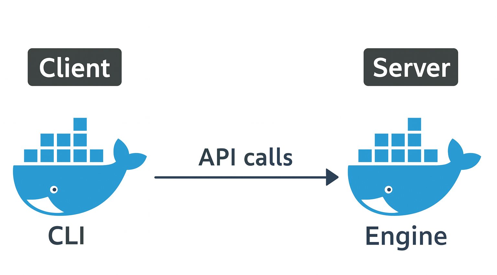
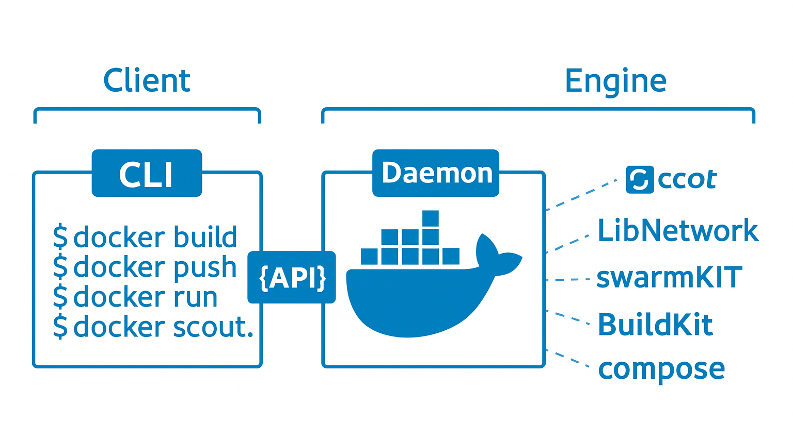

# 🐳 **Docker Overview**

Docker is at the heart of the modern **container ecosystem**.
However, the word **Docker** can mean two different things:

1. **The Docker Platform** → A collection of technologies for creating, managing, and orchestrating containers.
2. **Docker, Inc.** → The company that created and continues to develop Docker.

---

## 🏢 Docker, Inc.

* 📍 Based in **Palo Alto, USA**
* 👨‍💻 Founded by **Solomon Hykes** (French-born American developer & entrepreneur)
* 🛠️ Originally started as a **Platform as a Service (PaaS)** company called **dotCloud**
* ⚙️ dotCloud used containers internally and built a tool to manage them → they named it **Docker**
* ⚓ The term **Docker** comes from the British slang for a **dock worker**, someone who loads/unloads cargo from ships.

👉 In **2013**, dotCloud:

* Dropped the struggling PaaS business.
* Rebranded as **Docker, Inc.**
* Focused fully on **Docker and containers**.

---

## ⚙️ The Docker Platform

The Docker platform simplifies **building, sharing, and running containers**.

It has **two main parts**:

1. **🖥️ CLI (Client)**

   * The `docker` command-line tool.
   * Converts user commands into **API requests**.
   * Sends them to the Docker Engine.

2. **⚡ Engine (Server)**

   * Runs and manages containers.
   * Receives API calls from the CLI.
   * Handles container lifecycle and orchestration.

---

## 🖼️ Docker Architecture

### 🔹 High-level view (Client ↔ Engine)

<div align="center">
  

*Figure 2.1 – Docker client and engine.*
</div>

* **Client (CLI):** User interacts using `docker` commands.
* **Engine (Server):** Executes commands and manages containers.
* Communication happens via **API calls**.
* Client and Engine can be on the **same host** or connected **over a network**.

---

### 🔹 Detailed view (CLI ↔ Daemon ↔ Components)

<div align="center">
  

*Figure 2.2 – Docker CLI and daemon hiding complexity.*
</div>

* **Client (CLI):**

  * You run commands like:

    ```bash
    docker build
    docker push
    docker run
    docker scout
    ```
  * These get converted into **API requests**.

* **Daemon (Server side):**

  * Handles container operations behind the scenes.
  * Connects with specialized subcomponents.

* **Specialized Components in Engine:**

  * 🏗️ **BuildKit** → Builds container images efficiently.
  * 📦 **containerd** → Core container runtime.
  * ⚙️ **runc** → Low-level runtime to spawn containers.
  * 🌐 **LibNetwork** → Networking for containers.
  * 🔐 **Notary** → Image signing & security.
  * 🐙 **Compose** → Multi-container applications.
  * 🔄 **SwarmKit** → Native container orchestration.
  * 🗂️ **Registries** → Store & distribute images.
  * 🕵️ **Scout** → Security scanning & monitoring.

👉 **Key point:**
The **CLI hides the complexity** of all these tools. You type simple commands → CLI converts them to API calls → **Daemon + Engine handle the rest**.

---

# 📦 **Container-Related Standards and Projects**

Several important **standards** and **governance bodies** influence container development and the container ecosystem. 🌍

## 🏛️ Major Influencers

* **The OCI (Open Container Initiative)**
* **The CNCF (Cloud Native Computing Foundation)**
* **The Moby Project**

---

## 🔹 The Open Container Initiative (OCI)

The **Open Container Initiative (OCI)** is a **governance council** responsible for **low-level container-related standards**.
It operates under the **Linux Foundation** and was created during the early days of the container ecosystem.

### 📜 Background

* Originated when **CoreOS** opposed Docker’s dominance.
* CoreOS introduced an **open standard** called **appc** that defined specs for image format and container runtime.
* They also created a **reference implementation** called **rkt** (pronounced “rocket”).
* This led to two **competing standards** (Docker vs appc) → causing confusion.
* To solve this, major players united and created the **OCI** as a **vendor-neutral council**.
* Result: appc was archived, and **all low-level container specs are now governed by the OCI**.

### 📑 Current OCI Standards (Specs)

1. **image-spec** – Defines the container image format.
2. **runtime-spec** – Defines how containers should run.
3. **distribution-spec** – Defines how container images should be distributed and stored.

### 🚂 Rail Tracks Analogy

Just like **standardizing rail tracks** enabled growth in the railway industry 🚉, the OCI standards gave developers confidence to build tools and platforms that work universally with containers.

### 🐳 Docker & OCI Compliance

Modern Docker implements all three OCI specs:

* ✅ **BuildKit** → Creates OCI-compliant images
* ✅ **Docker runtime** → Runs OCI-compliant containers
* ✅ **Docker Hub** → Implements the OCI distribution spec (OCI-compliant registry)

**Fun fact:** Docker, Inc. and many other companies have people on the OCI’s **Technical Oversight Board (TOB)**.

---

## 🔹 The Cloud Native Computing Foundation (CNCF)

The **Cloud Native Computing Foundation (CNCF)** is another **Linux Foundation project**, founded in **2015** with the goal:

> “…advancing container technologies and making cloud native computing ubiquitous.” 🌐

### 📦 CNCF vs OCI

* **OCI** → Creates and governs **standards/specifications**
* **CNCF** → **Hosts and nurtures projects**

### 🌟 CNCF Projects

Some of the important CNCF-hosted projects include:

* Kubernetes ⚙️
* containerd 🐳
* Notary 🔐
* Prometheus 📊
* Cilium 🔗
* …and many more

### 🛤️ Project Maturity Phases

All CNCF projects go through **3 stages**:

1. **Sandbox** – Early stage, needs governance support.
2. **Incubating** – Growing, improving documentation, auditing, and community.
3. **Graduated** – Mature, production-ready, with strong governance and best practices.

Example: Docker itself uses **containerd** and **Notary**, both CNCF technologies.

---

## 🔹 The Moby Project

The **Moby Project** was created by **Docker** as a **community-led initiative** for developers building **specialized container platforms**.

### 🛠️ Key Points

* Platform builders can pick and choose **Moby tools** to build container platforms.
* They can combine **Moby tools + in-house tools + third-party tools**.
* Initially created by **Docker, Inc.**, but now includes members like:

  * Microsoft
  * Mirantis
  * Nvidia

### 🐳 Docker & Moby

The **Docker platform** itself is built using:

* Moby Project tools
* CNCF projects
* OCI standards

---
