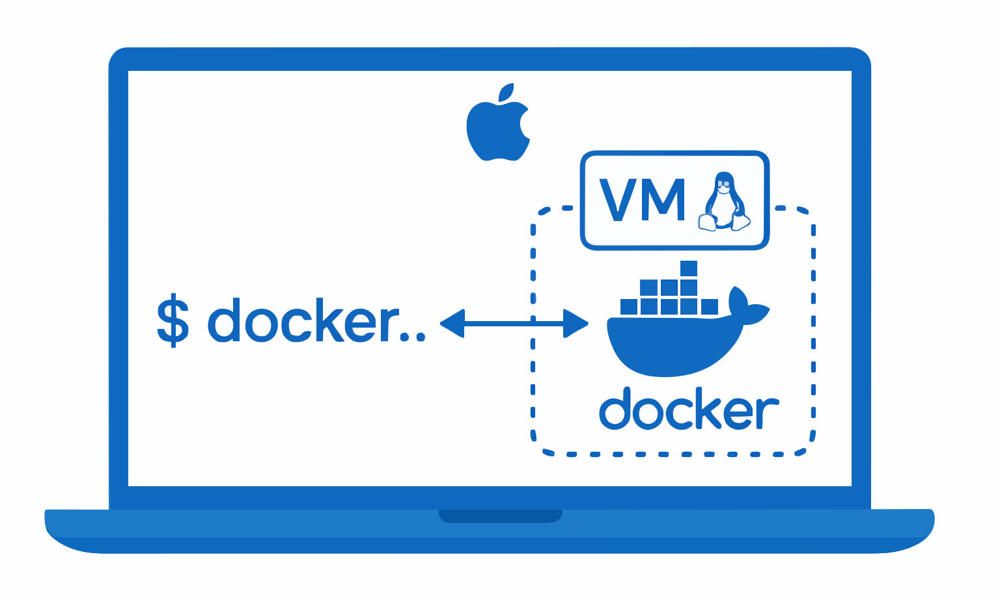

# 🐳 **Getting Docker**

<details>
<summary>📋 <strong>Table of Contents</strong></summary>

| 📖 **Section** | 🔧 **Installation Method** | 💡 **Description** |
|---|---|---|
| [💻 Docker Desktop](#-docker-desktop) | **Recommended** ✅ | Full-featured solution for all platforms |
| ├─ [🔹 Windows Prerequisites](#-windows-prerequisites) | Windows Setup | Hardware & WSL2 requirements |
| ├─ [🔹 Installing on Windows](#-installing-on-windows) | Windows Install | Step-by-step Windows installation |
| └─ [🔹 Installing on MacOS](#-installing-on-macos) | macOS Install | Step-by-step macOS installation |
| [☁️ Docker with Multipass](#️-installing-docker-with-multipass) | VM Solution | Cloud-style Linux VMs |
| ├─ [Basic Commands](#basic-commands) | VM Management | Core Multipass commands |
| └─ [Launching VM with Docker](#launching-a-vm-with-docker-pre-installed) | Quick Setup | Pre-configured Docker VM |
| [🐧 Docker on Linux](#-installing-docker-on-linux) | Native Linux | Direct Linux installation |
| ├─ [Example: Ubuntu 24.04](#example-ubuntu-2404) | Ubuntu Setup | Ubuntu-specific installation |
| └─ [Enable Docker without sudo](#enable-docker-without-sudo) | Permissions | User permission setup |

</details>

---

Docker can be installed and used in several ways. This guide covers:

* **Docker Desktop** (recommended ✅)
* **Multipass VM**
* **Server installs on Linux**

---

## 💻 Docker Desktop

Docker Desktop is the **best way to work with Docker** for most users. It provides:

* Docker Engine
* User-friendly UI
* Latest plugins and features
* Extensions marketplace
* **Docker Compose**
* Built-in **Kubernetes cluster** (optional)

👉 Free for personal/educational use.
👉 Requires license for enterprises with **>250 employees or >\$10M revenue**.

### 🔹 Windows Prerequisites

To install on **Windows 10/11 Professional or Enterprise**, you need:

* 64-bit Windows
* **Hardware virtualization** enabled in BIOS
* **WSL 2 (Windows Subsystem for Linux)**

⚠️ Be careful while changing BIOS settings.

### 🔹 Installing on Windows

1. Search for **“install Docker Desktop on Windows”** and download installer.
2. Enable **WSL 2 backend** during installation.
3. Start Docker Desktop from the Start Menu (watch the 🐳 whale icon load).
4. Verify installation:

```bash
$ docker version
```

✅ Expected Output (example):

```
Server: Docker Desktop 4.42.0
Engine:
 Version: 28.1.1
 API version: 1.49
 OS/Arch: linux/amd64
```

📌 By default, Docker uses **Linux containers** (OS/Arch shows `linux/amd64`).

You can switch to **Windows containers** via whale icon → *Switch to Windows containers*.

---

### 🔹 Installing on MacOS

Docker Desktop on Mac works similarly but always runs inside a **lightweight Linux VM**.

📌 This is why Mac only supports **Linux containers**.

<div align="center">
  

**Architecture (Figure 3.1):**
</div>


* Commands (`$ docker ...`) run on Mac terminal.
* Behind the scenes, they communicate with Docker Engine inside a Linux VM.

👉 Install:

* Search **“install Docker Desktop on MacOS”** and download installer.
* Start from Launchpad (🐳 whale icon appears in status bar).

Verify installation:

```bash
$ docker version
```

✅ Example Output:

```
Client:
 OS/Arch: darwin/arm64
Server:
 OS/Arch: linux/arm64
```

📌 Client = Mac native app
📌 Server = Linux VM daemon

---

## ☁️ Installing Docker with Multipass

⚠️ Use only if you **cannot install Docker Desktop**.
Multipass creates **cloud-style Linux VMs** on Mac/Windows/Linux.

👉 Install: [multipass.run/install](https://multipass.run/install)

### Basic Commands

```bash
$ multipass launch       # Create a new VM
$ multipass ls           # List VMs
$ multipass shell        # Access VM shell
```

### Launching a VM with Docker Pre-installed

```bash
$ multipass launch docker --name node1
```

✔ Downloads & launches VM with Docker.

Check VM:

```bash
$ multipass ls
```

Connect:

```bash
$ multipass shell node1
```

Inside VM, check Docker:

```bash
$ docker --version
$ docker info
```

Exit VM:

```bash
exit
```

Delete VM:

```bash
multipass delete node1
multipass purge
```

---

## 🐧 Installing Docker on Linux

⚠️ Use if Docker Desktop isn’t an option.
(Lacks some features like `docker scout`, `docker debug`, `docker init`).

### Example: Ubuntu 24.04

Install using Snap:

```bash
$ sudo snap install docker
```

Verify:

```bash
$ sudo docker --version
$ sudo docker info
```

### Enable Docker without `sudo`

By default, Docker commands need `sudo`. To avoid this:

```bash
$ sudo groupadd docker
$ sudo usermod -aG docker $(whoami)
$ sudo service docker start
```

✔ Now you can run Docker commands as a regular user.

---

## 🎯 Summary

* **Docker Desktop** → Recommended, full-featured (Windows/Mac/Linux).
* **Multipass** → Great for VM-based setups and clusters.
* **Linux Install** → Lightweight, but lacks some features.
