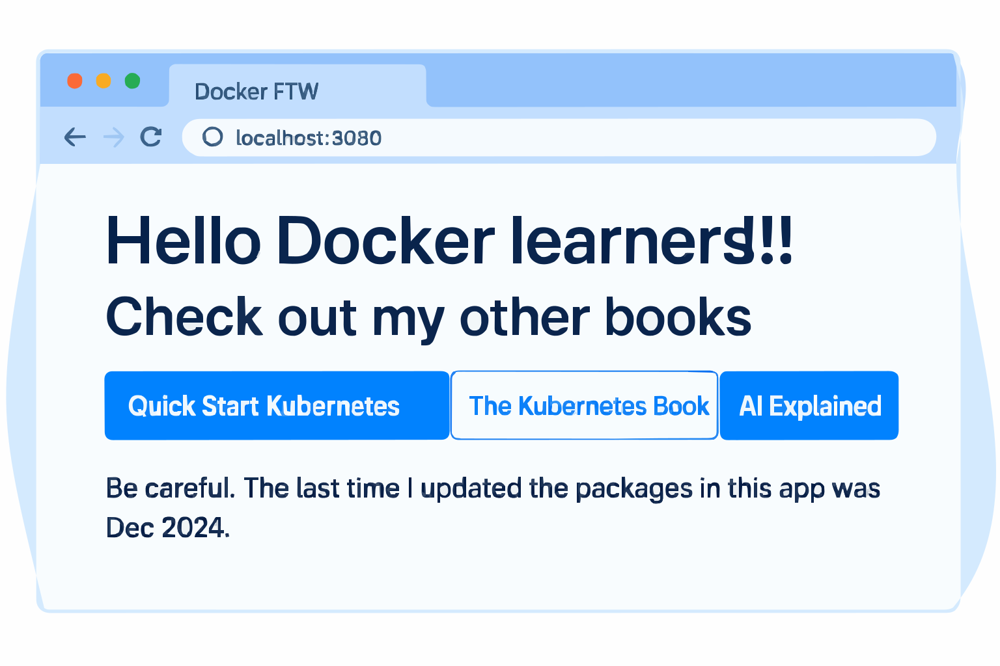

# 🌐 **The Big Picture of Docker**

This section will give you some **hands-on experience** and a **high-level view** of **images** and **containers**.
The goal is to prepare you for more detail in the upcoming sections.

---

<details>
<summary><strong>📋 Table of Contents</strong></summary>

| 🏷️ **Section** | 📝 **Description** | 🎯 **Focus Area** |
|---|---|---|
| [📖 Section Breakdown](#-section-breakdown) | Overview of Ops & Dev perspectives | Foundation |
| [🔍 Step 1: Check Docker is Working](#-step-1-check-docker-is-working) | Verify Docker installation | Setup |
| [📥 Step 2: Download an Image](#-step-2-download-an-image) | Pull NGINX image from registry | Image Management |
| [▶️ Step 3: Start a Container](#-step-3-start-a-container-from-an-image) | Launch container with port mapping | Container Operations |
| [💻 Step 4: Verify Container](#-step-4-verify-container-is-running) | Check running containers | Monitoring |
| [🗑️ Step 5: Delete Container](#-step-5-delete-the-container) | Stop and remove containers | Cleanup |
| [📂 Step 1: Clone Application](#-step-1-clone-the-application-repo) | Get sample Node.js app | Source Code |
| [🔎 Step 2: Inspect Dockerfile](#-step-2-inspect-the-dockerfile) | Understand build instructions | Image Building |
| [📦 Step 3: Containerize App](#-step-3-containerize-the-app) | Build Docker image | Development |
| [▶️ Step 4: Run the App](#-step-4-run-the-app-as-a-container) | Start application container | Deployment |
| [🌐 Step 5: Access the App](#-step-5-access-the-app) | Test application in browser | Testing |
| [🧹 Step 6: Clean Up](#-step-6-clean-up) | Remove containers and images | Maintenance |

</details>

---

## 📖 section Breakdown

We’ll divide this section into two perspectives:

1. **⚙️ The Ops Perspective**

   * Focus: starting, stopping, deleting containers, and executing commands inside them.

2. **👨‍💻 The Dev Perspective**

   * Focus: taking application source code, building it into a container image, and running it as a container.

👉 Reading both will give you a **Dev + Ops** perspective → *DevOps anyone?* 😎

---

# ⚙️ The Ops Perspective

In this section, you’ll complete all of the following:

* ✅ Check Docker is working
* 📥 Download an image
* ▶️ Start a container from the image
* 💻 Execute a command inside the container
* 🗑️ Delete the container

> A typical Docker installation installs both the **client** and the **engine** on the same machine and configures them to talk to each other.

---

## 🔍 Step 1: Check Docker is Working

Run the following command:

```bash
$ docker version
```

### 📝 Explanation

* `docker version` → Shows both **Client** and **Server** information, confirming Docker is installed and running properly.
* **Client block**: Info about your Docker CLI.
* **Server block**: Info about Docker Engine running in the background.

### ✅ Example Output

```bash
Client:
 Version: 28.1.1
 API version: 1.49
 Go version: go1.23.8
 OS/Arch: darwin/arm64
 Context: desktop-linux

Server: Docker Desktop 4.42.0
 Engine:
  Version: 28.11
  API version: 1.49 (minimum version 1.24)
  Go version: go1.23.8
  OS/Arch: linux/arm64
  containerd: 1.7.27
  runc: 1.2.5
  docker-init: 0.19.0
```

👉 If both **Client** and **Server** sections appear, everything is working fine.
👉 If on **Linux** you get `permission denied while trying to connect to the Docker daemon`, run with **sudo**:

```bash
$ sudo docker version
```

---

## 📥 Step 2: Download an Image

**Images** contain everything an app needs to run:

* OS filesystem
* Application
* Dependencies

🔹 For **Ops**, they’re like **VM templates**.
🔹 For **Developers**, they’re like **classes**.

Check current images:

```bash
$ docker images
```

If fresh installation → no images.
Now, **pull** (download) the latest NGINX image:

```bash
$ docker pull nginx:latest
```

### ✅ Example Output

```bash
latest: Pulling from library/nginx
ad5932596f78: Download complete
e4bc5c1a6721: Download complete
1bd52ec2c0cb: Download complete
...
Status: Downloaded newer image for nginx:latest
docker.io/library/nginx:latest
```

Check images again:

```bash
$ docker images
```

Output:

```bash
REPOSITORY   TAG     IMAGE ID       CREATED      SIZE
nginx        latest  fb197595ebe7   10 days ago  280MB
```

👉 Now you have a **stripped-down Linux + NGINX server app** ready to run.

---

## ▶️ Step 3: Start a Container from an Image

Run the container:

```bash
$ docker run --name test -d -p 8080:80 nginx:latest
```

### 📝 Explanation

* `docker run` → Start a new container.
* `--name test` → Names the container **test**.
* `-d` → Run in **detached mode** (background).
* `-p 8080:80` → Maps **host port 8080** → **container port 80**.
* `nginx:latest` → Base image.

👉 Output will be a long **container ID**, confirming creation.

---

## 💻 Step 4: Verify Container is Running

Check running containers:

```bash
$ docker ps
```

Example output:

```bash
CONTAINER ID   IMAGE         COMMAND       CREATED       STATUS      PORTS                   NAMES
e08c35352ff3   nginx:latest  "/docker..."  7 mins ago    Up 7 mins   0.0.0.0:8080->80        test
```

✅ Container is running → You can access it on `http://localhost:8080`.

---

## 🗑️ Step 5: Delete the Container

First, stop the container:

```bash
$ docker stop test
```

Then, remove it:

```bash
$ docker rm test
```

Check all containers (including stopped ones):

```bash
$ docker ps -a
```

Output will now be empty. 🎉

---

# 👨‍💻 **The Dev Perspective**

Containers are all about **applications**.
In this section, you’ll complete the following steps:

* 📂 Clone an app from a GitHub repo
* 🔎 Inspect the app’s Dockerfile
* 📦 Containerize the app
* ▶️ Run the app as a container

---

## 📂 Step 1: Clone the Application Repo

Clone the sample app from GitHub:

```bash
$ git clone https://github.com/nigelpoulton/psweb.git
```

### 📝 Explanation

* `git clone <repo_url>` → Creates a local copy of the repository.
* Here, we clone **psweb**, which contains a **Node.js web app**.

Expected output:

```bash
Cloning into 'psweb'...
remote: Enumerating objects: 63, done.
remote: Counting objects: 100% (34/34), done.
remote: Compressing objects: 100% (22/22), done.
remote: Total 63 (delta 13), reused 25 (delta 9), pack-reused 29
Receiving objects: 100% (63/63), 13.29 KiB | 4.43 MiB/s, done.
Resolving deltas: 100% (21/21), done.
```

Move into the repo directory and list files:

```bash
$ cd psweb
$ ls -l
```

Output:

```
-rw-r--r--  1 user staff 324  Feb 12 12:31 Dockerfile
-rw-r--r--  1 user staff 378  Feb 12 12:31 README.md
-rw-r--r--  1 user staff 341  Feb 12 12:31 app.js
-rw-r--r--  1 user staff 355  Feb 12 12:47 package.json
drwxr-xr-x  3 user staff  96  Feb 12 12:31 views
```

---

## 🔎 Step 2: Inspect the Dockerfile

The **Dockerfile** defines how to build the application into a container image.
View it with:

```bash
$ cat Dockerfile
```

Contents:

```dockerfile
FROM alpine
LABEL maintainer="nigelpoulton@hotmail.com"
RUN apk add --update nodejs npm curl
COPY . /src
WORKDIR /src
RUN npm install
EXPOSE 8080
ENTRYPOINT ["node", "./app.js"]
```

### 📝 Breakdown

* `FROM alpine` → Uses a lightweight Alpine Linux base image.
* `LABEL maintainer=...` → Metadata (author contact).
* `RUN apk add ...` → Installs Node.js, npm, and curl.
* `COPY . /src` → Copies app files into container at `/src`.
* `WORKDIR /src` → Sets working directory.
* `RUN npm install` → Installs dependencies.
* `EXPOSE 8080` → Tells Docker the app listens on port 8080.
* `ENTRYPOINT ["node", "./app.js"]` → Starts the Node.js app.

---

## 📦 Step 3: Containerize the App

Build the Docker image:

```bash
$ docker build -t test:latest .
```

### 📝 Explanation

* `docker build` → Builds an image.
* `-t test:latest` → Tags image as `test:latest`.
* `.` → Context is the current directory (psweb).

Expected output (simplified):

```
[+] Building 36.2s (11/11) FINISHED
...
=> => naming to docker.io/library/test:latest
```

Check image:

```bash
$ docker images
```

Output:

```
REPOSITORY   TAG     IMAGE ID       CREATED          SIZE
test         latest  0435f2738cf6   21 seconds ago   160MB
```

👉 Congratulations, you’ve **containerized the app** (built it into a Docker image).

---

## ▶️ Step 4: Run the App as a Container

Start a container:

```bash
$ docker run -d \
--name web1 \
--publish 8080:8080 \
test:latest
```

### 📝 Explanation

* `-d` → Run in detached mode (background).
* `--name web1` → Names the container **web1**.
* `--publish 8080:8080` → Maps host port `8080` → container port `8080`.
* `test:latest` → Image name.

---

## 🌐 Step 5: Access the App

Open a browser and go to:

* `http://localhost:8080` (if using Docker Desktop)
* Or your VM IP on port 8080 (if using Multipass).

Expected webpage:

<div align="center">
  
</div>

You’ll see:

```
Hello Docker learners!!!
Check out my other books
```

With navigation buttons like **Quick Start Kubernetes**, **The Kubernetes Book**, **AI Explained**.

---

## 🧹 Step 6: Clean Up

Stop and remove the container:

```bash
$ docker rm web1 -f
```

Remove the image:

```bash
$ docker rmi test:latest
```

Expected output:

```
web1
Untagged: test:latest
Deleted: sha256:0435f27...cac8e2b
```

---
