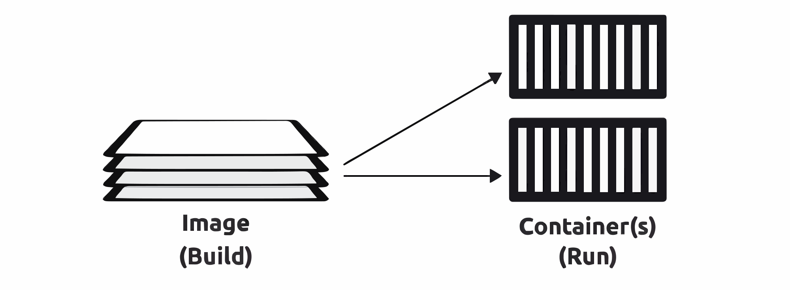
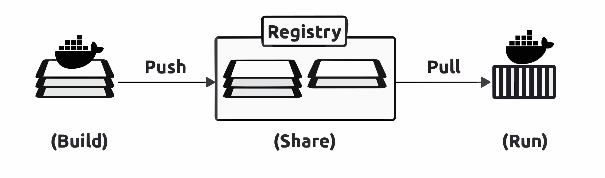
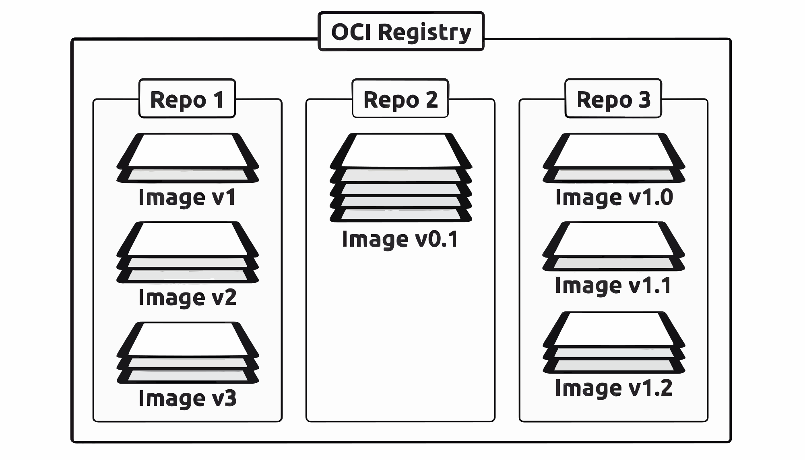
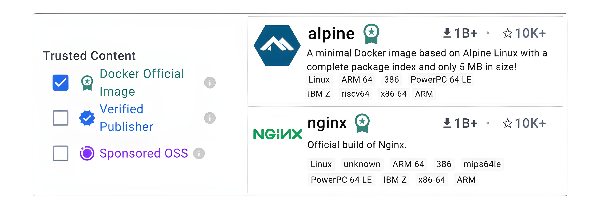

# 🐳 **Docker Images – The TLDR**

> **Quick Note:** 📝 Before we start, please know that all of these terms mean the same thing and we will use them interchangeably:
> * Image
> * Docker Image
> * Container Image
> * OCI Image

---

## What is an Image? 🖼️

An **image** is a **read-only package** that contains everything you need to run an application. Think of it as a complete bundle! 📦

This bundle includes:
* Application code 🖥️
* Dependencies (like libraries and frameworks) 🔗
* A minimal set of operating system (OS) constructs ⚙️
* Metadata (information about the image) ℹ️

A cool feature is that you can start **multiple containers** from just a **single image**.

---

## Analogies to Understand Images 💡

If you're trying to wrap your head around what an image is, these comparisons might help:

* **For those familiar with VMware:** 💻
    An image is a bit like a **VM template**. A VM template is like a stopped virtual machine, and similarly, an image is like a stopped container.

* **For Developers:** 🧑‍💻
    Images are similar to **classes** in object-oriented programming. You can create one or more **objects** from a single class. In the same way, you can create one or more **containers** from a single image.

---

## How to Get an Image? 📥

The easiest way to get an image is to **pull** (download) one from a **registry**.

The most common registry is **[Docker Hub](https://hub.docker.com)**. When you pull an image from Docker Hub, it gets downloaded to your local machine. From there, Docker can use it to start one or more containers.

While Docker Hub is the most popular, other registries exist, and Docker works perfectly with all of them.

---

## The Structure of an Image: Layers 겹

Docker creates images by stacking independent **layers** on top of each other and then representing them as a single, unified object.

For example, an image might be built like this:
* **Layer 1:** Has the basic OS components.
* **Layer 2:** Contains application dependencies.
* **Layer 3:** Holds the application itself.

Docker takes these layers, stacks them up, and makes them look like a single, seamless system.

---

## How Big Are Images? 📏

Images are usually quite **small**, which is great for storage and speed!

* The official **NGINX** image is around **80MB**.
* The official **Redis** image is around **40MB**.

However, it's good to know that **Windows images can be quite huge** in comparison.

That’s the elevator pitch for Docker Images! 🚀

---

# 🚀 **Introduction to Images**

We've already mentioned that **images are like stopped containers**. You can even stop an active container and create a brand-new image directly from it.

With this idea in mind, it's helpful to think of them this way:
* **Images** are **build-time** constructs 🏗️.
* **Containers** are **run-time** constructs 🏃.

---

## Visualizing the Process: Figure 6.1 📊

<div align="center">
  
</div>

The figure above shows the relationship between building an image and running containers.

* **On the left**, we see the **Image (Build)**. It is shown as a stack of layers, representing the build process.
* **On the right**, we see the **Container(s) (Run)**. The arrows show that a single image can be used to start multiple, separate containers.

This diagram perfectly illustrates the build-time and run-time nature of images and containers and highlights that many containers can be launched from one image.

---

## From Image to Container ➡️

The `docker run` command is the most common way to start a container from an image.

Once a container is running, the image and the container become bound together. This creates an important dependency:

> 🔐 You **cannot delete an image** until you stop and delete the container that is using it. If multiple containers are using the same image, you can only delete that image after you have deleted **all** of the containers using it.

---

## The Philosophy of Lean Containers 🍃

Containers are designed to run a **single application** or microservice. Because of this, they should only contain the essentials:
* Application code
* Required dependencies

You should **not** include non-essential items like build tools or troubleshooting utilities in your images.

---

## What are Slim Images? ✨

For example, the official **Alpine Linux** image is currently about **3MB**. This is incredibly small!

The reason it's so tiny is that it doesn’t come bundled with things you might not need, like:
* Six different shells
* Three different package managers
* A bunch of tools you "might" need once every ten years

In fact, it’s becoming more and more common for images to ship without a shell or a package manager at all. The rule is simple: if the application doesn’t need it at run-time, the image doesn’t include it. We call these **slim images**.

---

## Why Images Stay Small: No OS Kernel! 🧠

Another factor that keeps images small is the **lack of an OS kernel**.

This is because containers don't need their own kernel; they simply use the kernel of the host machine they are running on. The only OS-related parts in most images are filesystem objects. You will sometimes hear people say that images contain **"just enough OS"** to function.

---

## A Note on Windows Images 🪟

Unfortunately, **Windows images can be huge**. For example, some Windows-based images can be gigabytes in size and can take a long time to push (upload) and pull (download).


---

# 📥 **Pulling Images**

A brand new, clean Docker installation starts with an **empty local repository**.

-----

## What is the Local Repository? 📂

The **local repository** is simply a special area on your local machine where Docker stores images for easier and faster access. You might also hear it called the **image cache**.

  * **On Linux**, this is usually located at `/var/lib/docker/`.
  * **With Docker Desktop**, it's stored inside the Docker Virtual Machine (VM).

You can check what's inside your local repository by running the following command. The example below shows three images related to Docker Desktop extensions. Your list will likely be different and might even be empty.

### Code Snippet: Listing Local Images

```bash
docker images
```

### Explanation of the Command

This command lists all the Docker images currently stored on your local machine.

### Example Output

```
REPOSITORY    TAG      IMAGE ID      CREATED        SIZE
ubuntu        24.04    7c06e91f61fa  2 months ago   117MB
```

  * **REPOSITORY**: The name of the image.
  * **TAG**: The specific version of the image (e.g., `24.04`, `latest`).
  * **IMAGE ID**: A unique identifier for the image.
  * **CREATED**: When the image was built.
  * **SIZE**: The amount of disk space the image uses.

-----

## How to Pull an Image ☁️

The process of getting images from a registry (like Docker Hub) and downloading them to your local repository is called **pulling**.

Let's pull the official `redis` image and then check that it exists in our local repository.

> **Linux User Note** 🐧:
> If you are on Linux and haven't added your user account to the local `docker` Unix group, you may need to add `sudo` to the beginning of all the following Docker commands.

### Code Snippet: Pulling the Redis Image

```bash
docker pull redis
```

### Explanation of the Command

This command tells Docker to find an image named `redis` in the default registry (Docker Hub) and download it to your local machine.

### Command Output Explained

```
Using default tag: latest
latest: Pulling from library/redis
d107e437f729: Pull complete
cf596724f63e: Pull complete
a3f725691cac: Pull complete
d7e6e9e45ecf: Pull complete
bd022da7d981: Pull complete
4f4fb700ef54: Pull complete
349073970fc7: Pull complete
Digest: sha256:b0341dc2e0ce47beb7fcef80089b4d469b10ae94fbbea50072b878d7c88de487
Status: Downloaded newer image for redis:latest
docker.io/library/redis:latest
```

  * `Using default tag: latest`: Since we didn't specify a version, Docker automatically chose the `latest` tag.
  * `latest: Pulling from library/redis`: Docker confirms it's pulling the `latest` tag from the official `redis` library.
  * `d107e437f729: Pull complete`: Each of these lines represents a different layer of the image being downloaded. Images are made of multiple layers, and Docker pulls each one.
  * `Digest: sha256:...`: This is a unique signature for the image content, ensuring what you downloaded is authentic and hasn't been tampered with.
  * `Status: Downloaded newer image...`: A success message confirming the download is complete.
  * `docker.io/library/redis:latest`: This is the full, official name of the image that was pulled.

### Code Snippet: Verifying the Pull

Now, let's run `docker images` again to see the result.

```bash
docker images
```

### New Output

```
REPOSITORY    TAG      IMAGE ID      CREATED       SIZE
redis         latest   b0341dc2e0ce  6 weeks ago   200MB
ubuntu        24.04    7c06e91f61fa  2 months ago  117MB
```

As you can see, the `redis` image with the `latest` tag is now in our local repository, ready to be used\!

-----

## Docker's Default Assumptions 🤔

When we ran `docker pull redis`, Docker was "opinionated" and made two assumptions because we didn't provide more specific details:

1.  It assumed you wanted to pull the image tagged as **`latest`**.
2.  It assumed you wanted to pull the image from **Docker Hub**.

You can override both of these defaults, but Docker will always use them if you don't specify otherwise.


---

# ☁️ **Image Registries**

We store images in centralized places called **registries**. The main job of a registry is to securely store images and make them easy to access from different environments.

---

## The Build > Share > Run Pipeline: Figure 6.2 🏗️➡️🤝➡️🏃

<div align="center">
  
</div>


This figure shows just how central registries are in the typical workflow, which follows a <br/> **build > share > run** pipeline.

* **Step 1 (Build)**: On the far left, a layered **Image** is built.
* **Step 2 (Share)**: The image is then **Pushed** to a central **Registry**. This is the "share" phase of the pipeline, where the image becomes available to others.
* **Step 3 (Run)**: Finally, the image is **Pulled** from the registry to an environment where it can be used to launch a **Container**. This is the "run" phase.

---

## Technical Details and Standards ⚙️

Most modern registries implement the **OCI distribution-spec**, and because of this, we sometimes call them **OCI registries**.

Most registries also implement the **Docker Registry v2 API**. This is important because it means you can use standard tools, like the Docker Command Line Interface (CLI), to interact with them in a consistent way.

Some registries also offer advanced features, such as:
* Image scanning (for security vulnerabilities) 🕵️
* Integration with build pipelines 🔄

---

## Common Registries 🌐

The most common and well-known registry is **Docker Hub**. However, many others exist, including:
* 3rd-party internet-based registries
* Secure on-premises registries (hosted on your own private network)

As mentioned before, Docker is "opinionated" and will **default to using Docker Hub** unless you specifically tell it the name of a different registry. For the rest of this book, we'll use Docker Hub, but the principles apply to all other registries.

---

## Registry Architecture: Repositories and Images 🏛️

The structure of a registry is quite simple:
* Image registries contain one or more **image repositories**.
* Image repositories contain one or more **images** (usually different versions of the same software).

### Visualizing the Architecture: Figure 6.3

<div align="center">
  
</div>

This figure shows the architecture of a typical image registry.

* The outermost box represents the entire **OCI Registry**.
* Inside the registry, there are three distinct **image repositories**: `Repo 1`, `Repo 2`, and `Repo 3`.
* Within each repository, you can see one or more images. For example, `Repo 3` contains three different versions of an image: `Image v1.0`, `Image v1.1`, and `Image v1.2`.

---

# **Official Repositories** 🐳

Docker Hub's **official repositories** are a goldmine for developers. These images are handpicked by Docker and application vendors to ensure they are **up-to-date, secure, and well-documented**. Think of them as the trustworthy, verified software you want to build on.

You can easily spot them by their green **Docker Official Image** badge and their top-level location in the Docker Hub namespace. A few examples include:

* `nginx`: [https://hub.docker.com/\_/nginx/](https://hub.docker.com/_/nginx/) 🌐
* `busybox`: [https://hub.docker.com/\_/busybox/](https://hub.docker.com/_/busybox/) 📦
* `redis`: [https://hub.docker.com/\_/redis/](https://hub.docker.com/_/redis/) 💾
* `mongo`: [https://hub.docker.com/\_/mongo/](https://hub.docker.com/_/mongo/) 🍃

---

## **Unofficial Repositories** ⚠️

Now, let's talk about the "wild west"—**unofficial repositories**. You must be very careful when using these. For example, personal repositories:

* `nigelpoulton/gsd`: [https://hub.docker.com/r/nigelpoulton/gsd-book/](https://hub.docker.com/r/nigelpoulton/gsd-book/) 📚
* `nigelpoulton/k8sbook`: [https://hub.docker.com/r/nigelpoulton/k8sbook/](https://hub.docker.com/r/nigelpoulton/k8sbook/) ⚙️

The key giveaway here is the `nigelpoulton` second-level namespace. This immediately tells you they are **not official**.

The golden rule is to always assume that any image from an unofficial repository is **unsafe** until proven otherwise. It's simply a good security practice. Even with official images, a healthy dose of caution is always recommended.

---

<div align="center">
  
</div>


### **Figure 6.4 - Official Repos on Docker Hub** 🖼️✨

This figure beautifully illustrates two official repositories: **Alpine** and **NGINX**.

* **Official Image Badge**: Both repositories feature a green checkmark icon with the label "**Docker Official Image**". This is your clear sign of a trusted source. ✅
* **Key Information**: The figure shows important details, including the repository name, a brief description, and impressive statistics. You can see both have over a **billion pulls (1B+)** and more than **10,000 stars (10K+)**, which speaks volumes about their popularity. 🚀
* **Wide Compatibility**: The image also highlights that these images are available for many **CPU architectures**, such as ARM64 and 386. This proves they are highly versatile. 💻
* **Trust Indicators**: On the left, the "Trusted Content" panel shows a selected checkbox for "**Docker Official Image**", reinforcing their official status. ✔️

---